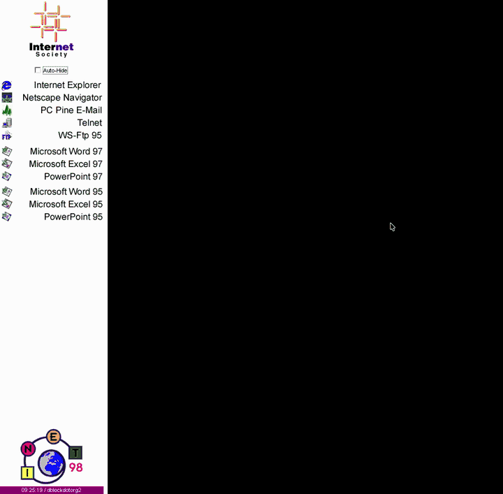

# INET '98

This repository holds the network help website for [INET '98](https://cordis.europa.eu/event/id/10498-inet98-internet-society-annual-conference), "The Internet Summit". INET '98 was the 8th annual conference of the [Internet Society](https://www.internetsociety.org/) (ISOC), held at Palexpo in Geneva, Switzerland, on 21–24 July 1998. The repository also holds the Windows launcher that ran on the conference's public PCs.

The [University of Geneva](https://www.unige.ch/presse/communique/97-98/inet%2798-07.98.html) provided the conference's computing and networking. It lent about 250 computers, run by its IT division. Prof. Jürgen Harms, head of the computer science department (CUI), led a team of eight engineers, mostly computer science students. They had worked on the project since March 1998, and the university valued its contribution at CHF 250,000. The machines booted from a CUI-developed boot ROM. It let one PC offer several operating systems, such as Windows and Linux, and kept each machine safe from viruses and user mistakes.

This copy of the site is dated 14 July 1998, a week before the conference opened.

## The Website

The site, `www.inet98.ch`, was the attendees' guide to the conference network. It was written by the CUI team, much of it by [Daniel Doubrovkine](https://github.com/dblock) (dB.). You can browse it today at [dblock.github.io/inet98](https://dblock.github.io/inet98/), served from [dblock/inet98](https://github.com/dblock/inet98).

* [index.html](index.html) is a frameset. At the top is a Java applet button bar, from [buttoncontrol/](buttoncontrol/).
* [pages/welcome.html](pages/welcome.html) introduces the team. [pages/sponsor.html](pages/sponsor.html) lists the sponsors: CUI, the University of Geneva, SWITCH, Sun, Cisco, Newbridge, DANTE, Incom, Apple, Anixter and others.
* [pages/equipment.html](pages/equipment.html) lists the equipment:
  * 126 HP Vectra VE4 Pentium 200 PCs
  * 30 Power Mac G3s and 10 G3 PowerBooks
  * 2 Sun Enterprise servers
  * 12 HP 4000N printers
  * Cisco and Newbridge switches and hubs
  * three /22 networks
  * external links: 45 Mbit/s to DANTE, 4 Mbit/s to Teleglobe, 34 Mbit/s to TEN-34, and a 155 Mbit/s backup to SWITCH
* [pages/application.html](pages/application.html) lists the software on the public PCs and Macs. The PCs ran Windows 95 in three setups: Desktop Publishing, Internet Access and Speakers Desk.
* [pages/configuration.html](pages/configuration.html) explains how to read your own email with Netscape or Internet Explorer.
* [pages/addressIP.html](pages/addressIP.html) explains how to connect a laptop in the Internet Access Room (IAR) or the Speaker Ready Room.
* [pages/speakers.html](pages/speakers.html) describes the equipment for speakers.
* [pages/plan.html](pages/plan.html) has floor plans of Palexpo.
* [forum/](forum/) is the Q&A forum, which ran on the Vestris aGNeS news forum CGI.
* [pages/search.html](pages/search.html) searches the site with [WebGlimpse](webglimpse/).

## The Launcher

[app/](app/) is the Inet 98 Launcher. It's the "Software Launcher replacing Explorer" that ran on every public PC. It was written by [Daniel Doubrovkine](https://github.com/dblock) (dB.) at the University of Geneva. It's a Delphi 3 program that shows a bar of buttons for the installed applications. It also has an idle screen saver, automatic reboot to reset each machine, and a remote-control TCP server for the staff.

[app/original/](app/original/) holds the 1998 source. [app/ported/](app/ported/) holds a Free Pascal and Lazarus port that builds and runs on macOS under Wine. See [app/README.md](app/README.md) for details.

## License

The launcher in [app/](app/), its build and demo scripts are released under the [MIT License](LICENSE). The exceptions are a few Delphi Runtime Library units, which are © 1996 Borland International.

The website is a historical archive of the INET '98 network site, preserved as it was in 1998. It isn't covered by the MIT License. Trademarks, logos and product icons belong to their respective owners.

## References

* [INET'98, juillet 1998](https://www.unige.ch/presse/communique/97-98/inet%2798-07.98.html) is the University of Geneva's press release (in French) about its role.
* [INET'98 - Internet Society annual conference](https://cordis.europa.eu/event/id/10498-inet98-internet-society-annual-conference) is the conference's listing on CORDIS.
* [INET '98, The Internet Summit: Abstracts](https://www.gbv.de/dms/tib-ub-hannover/248473867.pdf) is the book of abstracts, 21–24 July 1998, Palexpo, Geneva.
* [INET '98 Proceedings](https://publica.fraunhofer.de/entities/mainwork/9ba46246-4e01-44bd-b1df-2b1d58c59602) is the proceedings CD-ROM, ISBN 1-891562-02-9.
