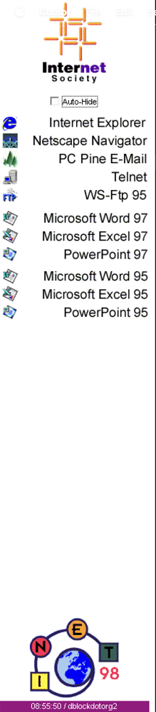

# Inet 98 Launcher

The launcher used on the public PCs at [INET '98](../README.md), the Internet Society conference held at Palexpo, Geneva, 21–24 July 1998.

The University of Geneva provided about 250 computers for the conference. The public Windows 95 PCs ran this program in place of Explorer. The conference site calls it the "Software Launcher replacing Explorer" ([pages/application.html](../pages/application.html)). It's a full-height bar on the left of the screen. It has a button for each installed application:

* Internet Explorer 4
* Netscape Navigator 4.05
* PC Pine
* Telnet
* WS-FTP 95
* Word 97 and Word 95
* Excel 97 and Excel 95
* PowerPoint 97 and PowerPoint 95

The bar also has an Internet Society logo, an INET 98 logo, a clock, and **Auto-Hide** and **Auto-Reboot** checkboxes.

It was written by Daniel Doubrovkine in Delphi 3, using his own `TSprite` animated-button component and shared `d32` helper units. The version string is `1.2207`, and the files are dated 13–16 July 1998.



In the demo below, the pointer hovers over the buttons, which show their highlight icons. Then the hidden `-stats` command asks for a password and shows the activity counters. Next, a remote session connects to the admin port. It gets an alarm on a wrong password and "Good morning dave!" on the right one. It then runs `HELP`, `MSG`, `HIDE`, `SHOW`, `STAT`, `SAVER` and `QUIT`.


A full-resolution version is in [inet98-launcher.mp4](inet98-launcher.mp4).

## What It Does

* **Launcher bar.** It stays on top, has no title bar and takes the full screen height. A button is hidden when its program isn't installed at the path hard-coded in `inetMain.pas`.
* **Idle handling.** After 2 minutes without input, it shows a screen saver, `bar\screen.bmp`. After 5 more idle minutes it resets the bar. If **Auto-Reboot** is checked, it also reboots Windows with a 10-second countdown that can be cancelled. Kiosk machines could then return to a clean state from the boot ROM.
* **Hidden commands.** Type `-command` then Enter on the bar to run a hidden command. Most of them ask for a password. The commands are `term`, `shell`, `hide`, `boot`, `stats`, `lock` and `ssh`.
* **Remote control.** A TCP server on port 895 lets staff manage a machine from elsewhere on the network. After a password, the available commands are:
  * `SHOW`, `HIDE`, `AUTOHIDE`, `AUTOREBOOT`: control the bar.
  * `MSG text`, `MODAL text`: show a pop-up message to the user.
  * `SOUND file`: play a sound.
  * `STAT`: report machine stats.
  * `BOOT`, `BOOTNOW`: reboot Windows.
  * `POWEROFF`, `POWEROFFNOW`: turn the power off.
  * `SHELL`, `COMMAND`, `TELNET`: launch a program.
  * `SAVER`, `SCREENSAVER`: show the screen saver now, or turn it on or off.
  * `LOCK`, `TERM`: block new connections, or quit the bar.

  Type `HELP` for the full list.
* **Start-up flags.** Empty files in `bar\` change the defaults: `noautoreboot`, `autohide`, `nosocket`, `noscreensaver`, `canclose` and `taskshow`. See [bar-options.txt](original/src/bar-options.txt).

## Layout

* [original/](original/) is the 1998 Delphi 3 source, unchanged.
  * `src/` holds the application: `inet98.dpr`, the `.pas` units, binary `.dfm` forms and the button artwork.
  * `sprite/` holds the `TSprite` component package.
  * `common.d32/` holds shared helper units.
* [ported/](ported/) is the same program, ported to build with Free Pascal and Lazarus (LCL).
  * `bin/` holds the release build, `inet98.exe`, and the files it loads at start-up.
* [scripts/](scripts/) holds the scripts that install the toolchain, build and run the port on macOS.
  * `demo/` holds the scripts that recorded the demo above.

## Building and Running

The original needs Delphi 3 on Windows 95 or 98. The port builds on macOS with the Windows (win32) version of Free Pascal and Lazarus running under Wine. It also runs under Wine.

```bash
app/scripts/setup.sh           # one-time: Wine + win32 Lazarus/FPC into ~/.cache/inet98 (~600 MB)
app/scripts/build.sh           # ported/bin/inet98.exe
app/scripts/run.sh             # launch the bar under Wine
```

A release build is committed in [ported/bin/](ported/bin/). To run it without building, install Wine and run `app/scripts/run.sh`, or run `wine inet98.exe` from that folder.

Pass `--debug` to both `build.sh` and `run.sh` to build and run `inet98-debug.exe`. It is a console build with line info that prints start-up exceptions to the terminal. Set `INET98_TOOLS` to install the toolchain somewhere else.

To try the remote control while the bar is running:

```text
$ nc 127.0.0.1 10895
InetServer Ready (c) Daniel Doubrovkine / University of Geneva
please identify yourself:
...
Good morning dave!
MSG hello from 2026
00 OK - non modal message:  hello from 2026
```

The password is `db4ever`. The typed password echoes as `*`.

`setup.sh` puts stand-in programs at the 1998 paths so that all eleven buttons show. Each one is a copy of Wine's Notepad. For example, `C:\PcPine\pine.exe` and `H:\msoffice.97\office\winword.exe`.

## Recording the Demo

[scripts/demo/](scripts/demo/) recorded the demo above on macOS. It needs `brew install ffmpeg cliclick gifsicle`. It also needs Screen Recording and Accessibility permissions for Terminal.

```bash
app/scripts/demo/record.sh     # records /tmp/inet98demo/rec.mov (~80 s, hands off)
app/scripts/demo/encode.sh     # writes inet98-launcher.mp4 and inet98-launcher.gif
```

`record.sh` starts the bar and opens a hidden Terminal window that runs `remote.py`, the scripted remote session. It auto-hides the menu bar, minimizes the front Terminal window and starts `ffmpeg`. Then `driver.sh` uses `cliclick` to hover over the buttons, enter `-stats` with its password, and reveal the remote session. When it's done, the script stops the bar and puts everything back. The coordinates assume a 1512×982 display.

## What It Took to Port

### Toolchain

* The Homebrew `wine-stable` and `wine@devel` casks are disabled because they fail Gatekeeper. `setup.sh` downloads the WineHQ macOS build from [Gcenx/macOS_Wine_builds](https://github.com/Gcenx/macOS_Wine_builds) instead.
* The Lazarus Windows installer uses Inno Setup, and it crashes under Wine with a stack overflow. `setup.sh` unpacks it with `innoextract`, then generates `fpc.cfg` with `fpcmkcfg`.
* Using the Windows compiler under Wine avoids building a macOS-to-win32 cross-compiler. It also lets the Windows version of the LCL (the Lazarus component library, the counterpart of Delphi's VCL) and the Win32 API units work as they are.

### Forms

* Delphi 3 saves forms as binary `.dfm` files. A small FPC program read each one with `ObjectBinaryToText`, and the output was saved as text `.lfm` files.
* Several embedded bitmaps have a colour count in the header that's larger than the palette actually stored. Some also have wrong file and pixel-data offsets. Delphi accepts these, but the LCL fails with "Stream read error". The headers were fixed in the `.lfm` files.
* Some properties that Delphi saved don't exist in the LCL, so they were removed or changed:
  * `IncrementalDisplay` was removed.
  * `TMaskEdit.PasswordChar` doesn't exist, so the password field is now a `TEdit`.
* Delphi doesn't save the `ModalResult`, `Default` and `Cancel` values that a `TBitBtn` gets from its `Kind`. The LCL only applies them when `Kind` is set in code, not when a form is loaded. Without them, the password dialog's OK button and the Enter key did nothing. They're now set in the `.lfm` files.

### Code

* `WinTypes` and `WinProcs` became `Windows`, and `{$R *.DFM}` became `{$R *.lfm}`. `inet98.lpr` adds `Interfaces`, plus an exception handler for the debug build.
* The Delphi 3 `SHLOBJ.PAS` was dropped in favour of FPC's `ShlObj`. `Mask` became `MaskEdit`, and `D32reg` now uses `Variants`.
* A few Win32 calls needed exact types: `GetComputerName` and `RegEnum*` take `DWORD` sizes, and `ExtractAssociatedIcon` takes a `PWORD`.
* `TWMQuit` became `TMessage`.
* The LCL has no `Application.OnMessage`. The minimize handler moved to `Application.OnMinimize`.
* `TSprite` created its own device context (DC) for each bitmap. In the LCL the bitmap stays selected in its canvas's DC, so the sprite now draws from `Image.Canvas.Handle`. Without this change the buttons came out blank.
* The original was built with `SpriteRegistered` defined, from `INET98.dof`. Without it, the unregistered sprite component overlays a white dot pattern on every button as a watermark. The build defines it.
* The window-position thread starts from `FormCreate` before `InterfaceControl` exists. Under Delphi 3 the timing happened to work, but under the LCL the thread crashed on its first tick and the clock never updated. It now waits for the forms it uses.
* The Delphi VCL's `ScktComp` (`TServerSocket`) and `MPlayer` (`TMediaPlayer`) aren't in the LCL. They're replaced by small versions in [ported/compat/](ported/compat/):
  * The socket server is built on FPC's `ssockets`. It listens on 127.0.0.1 only. macOS doesn't let a normal user bind port 895, so it falls back to 10895.
  * The media player uses MCI.
* Rebooting and powering off are disabled. The original called `ExitWindowsEx`, and for power-off an APM BIOS call through `int 15h`. The port just quits instead.
